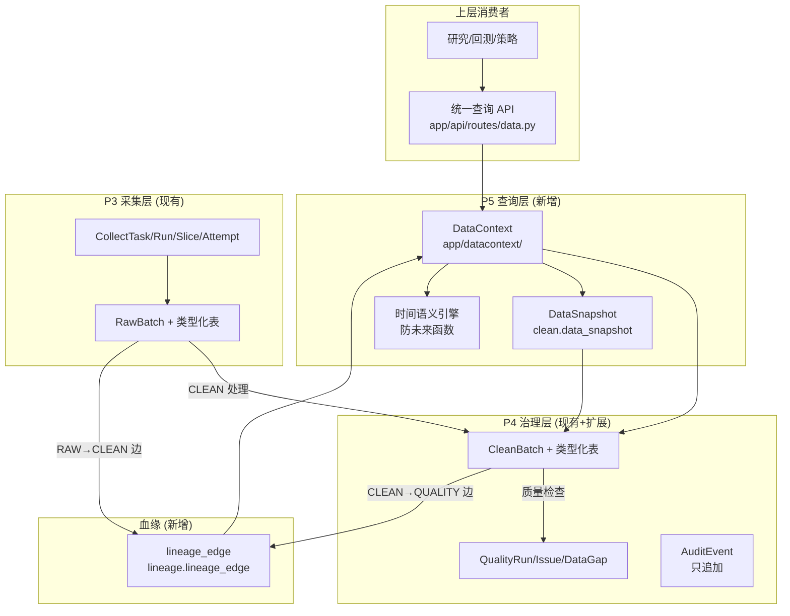

# Design: 第2步数据底座 (S2-002—S2-025)

> analysis_scope: system_governance
> capability_verdict: reuse_existing

本文档是 quantStock1 第2步数据底座的完整模块设计候选，覆盖 P3/P4/P5 三个阶段的 35 个 MUST 需求。设计基于真实代码事实（`app/storage/models/`, `app/lineage/service.py`, `migrations/versions/`, `compose.dev.yml`），不编造任何架构、数据模型或代码归属。

---

## 1. Problem Understanding

### 1.1 症状 vs 直接问题 vs 根因

| 层级 | 描述 |
|---|---|
| 症状 | 上层研究/回测无法获得一致且正确的历史数据视图；运维缺乏独立测试环境和恢复能力 |
| 直接问题 | DataContext 模块不存在、lineage_edge 表不存在、DataSnapshot 不存在、防未来规则不存在、统一查询 API 不存在、server-test 不存在 |
| 根因 | 现有数据底座完成了 P3（采集）和 P4（治理/分层存储）的数据链路，但缺少 P5（查询契约与复现能力），导致 RAW→CLEAN→QUALITY 链路虽已闭环却无法被上层安全消费 |

### 1.2 待证事实

- `prod-environment.md` / `project-rules.md` 为 TODO 占位，运行时约束（Python 最低版本、资源限制、网络约束）仅从 `intake.md` 和 `pyproject.toml` 推导，标记为 assumption
- `extension_registry.json` 的 contracts 块全空；共享枚举（run_type, quality_status, frequency 等）尚未登记，遵循 Brownfield 降级规则——不 block，标记建议登记

---

## 2. Existing Architecture Analysis

### 2.1 真实组件与调用链

```
app/core/config.py        → Settings (pydantic-settings, env_prefix=QUANTSTOCK1_)
app/storage/db.py         → SQLAlchemy Engine (pool_pre_ping, hide_parameters)
app/storage/models/       → 6 schema: meta, ops, raw, clean, quality, audit
app/catalog/bootstrap.py  → DataItem 种子化
app/datasource/tushare.py → Tushare 适配器
app/collect/              → executor, idempotency, state_machine, repository, scheduler, worker, rate_limit, planners
app/governance/           → executor, minute_rules, tasks
app/lineage/service.py    → 服务层遍历 (clean_batch_lineage, data_lineage) — 无 lineage_edge 表
app/api/routes/           → lineage.py, ops.py, system.py — 无数据查询路由
app/ops/service.py        → 运维服务
```

### 2.2 数据库 Schema 现状（基于代码事实）

| Schema | 表 | 关键状态 |
|---|---|---|
| meta | data_source, data_item, storage_policy, source_binding | DataItem 有 business_time_field/history_start/update_mode/retention_class，缺 quality_policy_ref |
| ops | task_definition, collect_task, collect_run, request_slice, slice_attempt, worker_registry, scheduler_state, data_watermark, task_checkpoint, clean_run, rate_limit_state, circuit_breaker_state | CollectTask.run_type 无 DB CHECK；幂等键唯一约束已存在 |
| raw | raw_batch + 9 类型化表 | RawBatch 缺 content_hash/fetched_at/schema_fingerprint（类型化 RAW 表有 content_hash/fetched_at） |
| clean | clean_batch, clean_batch_input, clean_candidate_row, clean_skipped_row, trade_calendar, security_master, security_master_history, stock_daily, stock_adj_factor, stock_adj_factor_history, stock_daily_basic, stock_suspend_event, stock_limit_price, stock_minute | CLEAN 记录有 _available_at/_quality_status/_source/_mapping_version/_normalization_version/_quality_rule_version/_clean_batch_id；缺 _published_at、valid_from/valid_to/is_current；**无财务 CLEAN 表**；stock_minute 已是 TimescaleDB hypertable |
| quality | quality_run, quality_issue, data_gap, issue_task_link | DataGap 缺 VERIFIED 中间态约束 |
| audit | audit_event | 缺 event_type/run_id/environment_id；无只追加触发器 |
| lineage | （不存在） | 需新建 schema + lineage_edge 表 |

### 2.3 CLEAN 表物理列命名约定

现有 CLEAN 类型化表使用下划线前缀命名物理列（如 `_available_at` 映射到 Python 属性 `available_at`）。新增字段必须遵循此约定。

### 2.4 迁移链现状

head = `0012_p4_minute_governance`。TimescaleDB extension 在 0001 创建，hypertable 仅用于 `clean.stock_minute`（0012 创建）。所有新 DB 结构变化从 `0013` 起。

---

## 3. Governance Classification

本次变更涉及的治理层：

| 治理层 | 是否涉及 | 说明 |
|---|---|---|
| Standard | 否 | 不修改 SpecForge 标准 |
| Contract | 部分 | 需登记共享枚举（run_type, quality_status, frequency, time_mode），但属 Brownfield 降级，不 block |
| Workflow Skill | 否 | feature_spec 已能承载 |
| Agent | 否 | sf-executor/sf-verifier 已能承载 |
| Tool | 否 | sf_code_permission/sf_changed_files_audit 已能承载 |
| Runtime | 否 | 不修改 Runtime |
| Audit | 否 | 不修改 Audit |

---

## 4. Existing Capability Assessment

### 4.1 SpecForge 治理链能力评估

| 能力 | 评估 | 说明 |
|---|---|---|
| Standard (需求/设计/任务/Gate/Merge/Close) | reuse | feature_spec 全生命周期已支持 |
| Contract (extension_registry) | reuse | 空注册表适用 Brownfield 降级，不阻塞 |
| Workflow Skill (feature_spec) | reuse | requirement_change_path 已选定 |
| Agent (sf-executor, sf-verifier) | reuse | 标准 Agent 已能执行与验证 |
| Tool (sf_code_permission, sf_changed_files_audit) | reuse | 标准工具已能授权与审计 |

### 4.2 capability_verdict: reuse_existing

本次开发是目标项目 quantStock1 的功能开发，不需要扩展 SpecForge 治理能力。所有新增模块（DataContext, data API, lineage_edge, DataSnapshot）都在现有治理框架内通过 normal Candidate → Gate → User Decision → Merge 路径完成。

---

## 5. Solution Strategy

### 5.1 最小变更原则

- **新增** `app/datacontext/` 模块（DataContext 查询入口 + 时间语义引擎）
- **新增** `app/api/routes/data.py`（统一查询 API）
- **新增** `lineage` schema + `lineage_edge` 表
- **新增** `clean.data_snapshot` + `clean.data_snapshot_input` 表
- **新增** 财务 CLEAN 表（`clean.financial_income`, `clean.financial_indicator`）
- **扩展** 现有 CLEAN 表（新增 `_published_at` 字段）
- **扩展** AuditEvent（新增 event_type/run_id/environment_id + 只追加触发器）
- **新增** 3 个 Alembic 迁移（0013-0015）
- **新增** 运维脚本目录（迁盘、备份、恢复、归档）
- **新增** server-test compose 配置
- **不改** 现有迁移链、不改 RAW 写入逻辑、不改采集状态机核心流程

### 5.2 不改什么

- 不修改已执行的历史迁移 0001-0012
- 不引入 Celery/Redis/Kafka/K8s
- 不改变现有模块化单体架构
- 不修改 RAW schema 的写入路径

### 5.3 迁移规划

| 迁移 | 内容 | 涉及 REQ |
|---|---|---|
| 0013 | lineage schema + lineage_edge 表；clean.data_snapshot + data_snapshot_input 表 | REQ-CORE-013, 019, 020 |
| 0014 | CLEAN 表新增 _published_at 列；财务 CLEAN 表（financial_income, financial_indicator）；DataItem 元数据补齐种子 | REQ-CORE-001, 006, 008, 022 |
| 0015 | AuditEvent 扩展（event_type/run_id/environment_id）+ 只追加触发器；run_type CHECK 约束 + 历史修复；DataGap VERIFIED 状态约束；Worker LOST 恢复配置 | REQ-CORE-002, 003, 004, 005, 012, 014, 015 |

---

## 架构图



## Out of Scope

- Feature/Analysis/StockPool/Strategy/BacktestRun/RiskEvaluation/Signal/UserDecision 等未来阶段对象（第3步及以后）
- 旧 quantStock 在线依赖（仅可作只读迁移来源）
- 全市场分钟数据扩展（在迁盘、压缩、归档和恢复完成前禁止）
- 实时分钟行情（V1 仅 T+1 或批量）
- Celery/Redis/Kafka/K8s/微服务拆分
- 修改已执行历史迁移 0001-0012

## Assumptions（设计假设）

- 假设 Python >=3.11,<3.12（来自 intake.md，prod-environment.md 为 TODO）
- 假设 PostgreSQL 16 + TimescaleDB 2.28.3（来自 intake.md）
- 假设 svr3 服务器 4 CPU 资源（来自 NFR §5.4）
- 假设生产环境网络可达 Tushare API（来自现有 datasource 配置）
- 假设 query_timeout 默认 30 秒（来自 REQ-CORE-027 配置点）
- 假设 worker_lost_threshold 默认 10 分钟、recovery_sla 默认 15 分钟（来自 REQ-CORE-002 配置点）
- requires_user_confirmation: prod-environment.md 和 project-rules.md 需在实现前由用户填充或确认

---

## 设计决策

### DD-CORE-001 DataItem 元数据补齐与质量策略引用

- **refs**: [REQ-CORE-001]
- basis_refs: [CODE_OBSERVED-meta.py:DataItem, INTAKE-14-28, TASKBOOK-§5]
- constrained_by: DataItem 模型已有 business_time_field/history_start/update_mode/retention_class/frequency/grain/availability_rule/schema_version 字段

当前实现：`meta.DataItem` 模型已具备 9 个核心元数据字段，但种子数据中部分为空或占位，且缺 `quality_policy_ref`。

设计方案：在迁移 0014 中通过 `op.execute` 补齐 10 个 DataItem 的元数据种子值。新增 `quality_policy_ref` 列（`VARCHAR(64)`）到 `meta.data_item` 表。每个 DataItem 必须填充：

| DataItem | business_time_field | update_mode | frequency | retention_class |
|---|---|---|---|---|
| trade_calendar | calendar_date | event | daily | permanent |
| stock_basic | list_date | event | irregular | permanent |
| stock_daily | trade_date | incremental | daily | hot_5y |
| stock_adj_factor | trade_date | incremental | daily | hot_5y |
| stock_daily_basic | trade_date | incremental | daily | hot_5y |
| stock_suspend | trade_date | event | irregular | hot_5y |
| stock_limit_price | trade_date | incremental | daily | hot_5y |
| stock_minute | trade_time | incremental | minute | hot_1y |
| financial_income | end_date | event | quarterly | hot_5y |
| financial_indicator | end_date | event | quarterly | hot_5y |

拒绝空元数据进入 ACTIVE 状态：在应用层 `catalog` 模块校验，business_time_field 或 update_mode 为空时返回 `DATAITEM_METADATA_INCOMPLETE` 错误码。

### DD-CORE-002 Worker LOST 与 Lease 超时恢复机制

- **refs**: [REQ-CORE-002]
- basis_refs: [CODE_OBSERVED-ops.py:WorkerRegistry/RequestSlice, TASKBOOK-§6]
- constrained_by: worker_lost_threshold=10min, recovery_sla=15min（可配置）

当前实现：`ops.WorkerRegistry` 有 `status`(String16) 和 `heartbeat_at` 字段；`ops.RequestSlice` 有 `leased_by/leased_at/lease_expires_at/heartbeat_at` 字段。状态值在应用层管理，无 LOST 自动识别和恢复调度。

设计方案：

在 `app/collect/scheduler.py` 中新增 `recover_lost_workers()` 调度任务，每次扫描周期执行：
1. 查询 `status IN ('ONLINE','BUSY') AND heartbeat_at < now() - interval 'worker_lost_threshold'` 的 Worker
2. 将其 `status` 置为 `LOST`
3. 将其持有的 `status='RUNNING'` 的 CollectRun/RequestSlice 标记为可恢复（`status='RECOVERABLE'`）
4. 允许其他 ONLINE Worker 通过 Lease 接管 RECOVERABLE 状态的 Slice

终态不可逆约束：在迁移 0015 中为 `collect_run` 和 `slice_attempt` 添加 CHECK 约束阻止终态回退（通过应用层状态机 + 审计，不使用 DB CHECK 因终态组合复杂）。

新增配置项到 `app/core/config.py`：
```python
worker_lost_threshold_seconds: int = 600  # 10 分钟
recovery_sla_seconds: int = 900           # 15 分钟
```

#### CP-CORE-001 LOST 恢复正确性属性
- 任意心跳超时 Worker 在 `recovery_sla` 内被识别为 LOST
- LOST Worker 的 RUNNING 状态 Run/Slice 被标记为 RECOVERABLE
- 终态（SUCCEEDED/FAILED/CANCELLED）不可回退到 RUNNING

### DD-CORE-003 run_type CHECK 约束与历史修复

- **refs**: [REQ-CORE-003]
- basis_refs: [CODE_OBSERVED-ops.py:CollectTask.run_type, TASKBOOK-§4.C2]
- constrained_by: run_type 枚举 = {INITIALIZE, INCREMENTAL, BACKFILL, REPAIR, RETRY}（建议登记为 shared_enum，owner=CORE）

当前实现：`CollectTask.run_type` 是 `String(32)`，无 DB CHECK 约束，仅在应用层校验。

设计方案：在迁移 0015 中添加 CHECK 约束：
```sql
ALTER TABLE ops.collect_task
  ADD CONSTRAINT ck_collect_task_run_type
  CHECK (run_type IN ('INITIALIZE','INCREMENTAL','BACKFILL','REPAIR','RETRY'));
```

历史修复：迁移中扫描现有 `run_type` 值，若存在非枚举值则映射到最接近的合法值并记录到 AuditEvent。

### DD-CORE-004 幂等键 DB 约束完善

- **refs**: [REQ-CORE-004]
- basis_refs: [CODE_OBSERVED-ops.py:CollectTask.idempotency_key, TASKBOOK-§8]

当前实现：`CollectTask` 已有 `UniqueConstraint("idempotency_version", "idempotency_key")`；`SliceAttempt` 已有 `UniqueConstraint("slice_id", "attempt_no")`；`RequestSlice` 已有 `UniqueConstraint("task_id", "partition_key")` 和 `request_hash` 字段。

设计方案：现有 DB 约束已满足 REQ-CORE-004 的验收标准 1 和 2。补充：
- 在应用层 `collect/idempotency.py` 中强化强制重跑路径：当幂等键冲突且业务要求重跑时，必须携带 `run_type IN ('RETRY','REPAIR')` 标识，生成新 Run/Attempt
- 验收标准 3（不可控重复为 0）由现有唯一约束保证

### DD-CORE-005 RAW 来源证据字段补齐

- **refs**: [REQ-CORE-005]
- basis_refs: [CODE_OBSERVED-raw.py:RawBatch, CODE_OBSERVED-raw.py:类型化表, TASKBOOK-§6.RAW]

当前实现：
- `RawBatch` 有 `request_hash`, `row_count`, `schema_version`（3/5 证据字段）
- 类型化 RAW 表（如 `TushareDaily`）有 `fetched_at`, `content_hash`, `request_hash`, `schema_version`（4/5 证据字段）
- `RawBatch` 缺 `content_hash`, `fetched_at`；缺 `schema_fingerprint`
- 7 跳引用链：RawBatch → CollectRun → CollectTask, RawBatch → SourceBinding, RawBatch → RequestSlice → SliceAttempt → CollectRun

设计方案：在迁移 0015 中为 `raw.raw_batch` 新增 `content_hash VARCHAR(128)`, `fetched_at TIMESTAMPTZ`, `schema_fingerprint VARCHAR(128)` 三个列。应用层在 RawBatch 写入时从类型化表聚合填充。

7 跳引用链完整性验证（p95 ≤ 3s）：现有外键链已覆盖 RawBatch→CollectRun→CollectTask（2跳）, RawBatch→SourceBinding（1跳）, RawBatch→RequestSlice→SliceAttempt→CollectRun（3跳），合计覆盖 7 个上游对象。通过 `lineage_edge` 表（DD-CORE-011）可进一步加速追溯查询。

#### CP-CORE-002 RAW 证据完整性属性
- 任一 RawBatch 可通过外键链回查 7 个上游对象
- 5 个证据字段（request_hash, record_count, fetched_at, content_hash, schema_fingerprint）全部非空

### DD-CORE-006 CLEAN 记录版本与时间属性（available_at 约束）

- **refs**: [REQ-CORE-006, REQ-CORE-009]
- basis_refs: [CODE_OBSERVED-clean.py:类型化表, TASKBOOK-§6.CLEAN]
- constrained_by: CLEAN 物理列使用下划线前缀命名约定

当前实现：CLEAN 类型化表有 `_available_at`, `_quality_status`, `_source`, `_mapping_version`, `_normalization_version`, `_quality_rule_version`, `_clean_batch_id`, `_created_at`, `_updated_at` 共 9 个治理列。缺：
- `_published_at`（发布时间，与 `_available_at` 分离）
- 版本区间字段（`valid_from`/`valid_to`/`is_current`）— 仅 history 表有

设计方案：

1. **published_at 分离（REQ-CORE-022）**：在迁移 0014 中为所有 CLEAN 类型化表新增 `_published_at TIMESTAMPTZ` 列。语义：
   - `_published_at` = 数据写入/发布到平台的时间
   - `_available_at` = 对研究可用的时间 = `_published_at` + 静默期 N（由 `DataItem.availability_rule` 配置）

2. **available_at 约束（REQ-CORE-009）**：在 DataContext 查询层强制附加 `available_at <= min(as_of_time, available_at_cutoff)` 条件。不在 DB 层做 CHECK（因为查询时点是动态的），而在 DataContext 查询构造器中强制注入。

3. **版本区间（REQ-CORE-006 验收标准 3）**：日线类数据保持覆盖模式（最新即为当前版本），财务类数据使用多版本表（见 DD-CORE-008）。

### DD-CORE-007 复权分层与动态计算

- **refs**: [REQ-CORE-007]
- basis_refs: [CODE_OBSERVED-clean.py:CleanStockDaily/CleanStockAdjFactor, TASKBOOK-§6.复权]

当前实现：
- `clean.stock_daily`（未复权行情）和 `clean.stock_adj_factor`（复权因子）已分离存储
- `clean.stock_adj_factor_history` 存在（版本历史）
- 无动态复权计算函数

设计方案：在 `app/datacontext/` 中实现 `adjustment.py` 模块：

```python
class AdjustmentPolicy(Enum):
    NONE = "none"          # 未复权
    FORWARD = "forward"    # 前复权
    BACKWARD = "backward"  # 后复权

def apply_adjustment(
    daily_rows: list[CleanStockDaily],
    adj_factors: list[CleanStockAdjFactor],
    policy: AdjustmentPolicy,
) -> list[dict]:
    """动态计算复权价格，不修改原始未复权值"""
    # 前复权：以最新因子为基准向后调整
    # 后复权：以最早因子为基准向前调整
    ...
```

复权因子缺失或断点时，在查询结果中标记 `quality_status=WARNING`，拒绝伪造连续价格。

#### CP-CORE-003 复权不变性属性
- stock_daily 的未复权原始值永不被复权计算改写
- 复权因子断点时返回 WARNING 而非伪造价格

### DD-CORE-008 财务修订多版本保留

- **refs**: [REQ-CORE-008]
- basis_refs: [CODE_OBSERVED-raw.py:TushareIncome/TushareFinaIndicator, TASKBOOK-§6.财务]
- constrained_by: CLEAN 层当前无财务类型化表

当前实现：RAW 层有 `raw.tushare_income` 和 `raw.tushare_fina_indicator`，CLEAN 层无对应财务表。

设计方案：在迁移 0014 中新建财务 CLEAN 表，支持多版本共存：

```sql
CREATE TABLE clean.financial_income (
    income_version_id UUID PRIMARY KEY DEFAULT gen_random_uuid(),
    security_code VARCHAR(16) NOT NULL,
    report_period DATE NOT NULL,          -- 报告期 (end_date)
    announce_time TIMESTAMPTZ NOT NULL,   -- 公告时间
    -- 业务字段（从 TushareIncome 映射的核心字段）
    total_revenue DOUBLE PRECISION,
    revenue DOUBLE PRECISION,
    n_income DOUBLE PRECISION,
    basic_eps DOUBLE PRECISION,
    -- 版本治理字段
    revision_version INT NOT NULL DEFAULT 1,
    valid_from TIMESTAMPTZ NOT NULL,
    valid_to TIMESTAMPTZ,
    is_current BOOLEAN NOT NULL DEFAULT true,
    source_version VARCHAR(32) NOT NULL,
    _clean_batch_id UUID NOT NULL REFERENCES clean.clean_batch(clean_batch_id),
    _source VARCHAR(32) NOT NULL,
    _available_at TIMESTAMPTZ NOT NULL,
    _published_at TIMESTAMPTZ NOT NULL,
    _quality_status VARCHAR(16) NOT NULL,
    _mapping_version VARCHAR(32) NOT NULL,
    _normalization_version VARCHAR(32) NOT NULL,
    _quality_rule_version VARCHAR(32) NOT NULL,
    _created_at TIMESTAMPTZ NOT NULL DEFAULT now(),
    _updated_at TIMESTAMPTZ NOT NULL DEFAULT now()
);
-- 部分唯一索引：同一 business_key 的 is_current=true 版本唯一
CREATE UNIQUE INDEX uq_financial_income_current
  ON clean.financial_income (security_code, report_period)
  WHERE is_current = true;
```

`clean.financial_indicator` 同构（业务字段从 `TushareFinaIndicator` 映射核心指标如 eps, roe, bps 等）。

修订规则：来源发布同一报告期修订数据时，创建新版本行（revision_version 递增），旧版本 `is_current=false, valid_to=now()`。禁止 UPDATE/DELETE 已发布版本。

#### CP-CORE-004 财务修订不变性属性
- 同一报告期多版本可共存，修订通过 INSERT 新版本而非 UPDATE
- 时点查询仅返回 valid_from ≤ as_of_time 且 available_at ≤ cutoff 的版本

### DD-CORE-009 质量发布门禁（FAILED 阻断 / WARNING 策略）

- **refs**: [REQ-CORE-010, REQ-CORE-011]
- basis_refs: [CODE_OBSERVED-clean.py:quality_status, TASKBOOK-§6.质量]

当前实现：CLEAN 记录有 `_quality_status` 字段（String16），取值如 PASSED/WARNING/FAILED。无发布门禁逻辑（因为 DataSnapshot 尚不存在）。

设计方案：在 DataSnapshot 构建逻辑（DD-CORE-015）中实现质量门禁：

```python
class QualityPolicy(BaseModel):
    publish_warning: bool = True   # 是否允许 WARNING 进入 Snapshot
    block_failed: bool = True      # FAILED 始终阻断（不可配置）

def filter_by_quality(rows, policy: QualityPolicy) -> tuple[list, QualityStats]:
    passed = [r for r in rows if r.quality_status == "PASSED"]
    warnings = [r for r in rows if r.quality_status == "WARNING"]
    failed = [r for r in rows if r.quality_status == "FAILED"]
    # FAILED 永远排除
    selected_warnings = warnings if policy.publish_warning else []
    skipped_failed_count = len(failed)
    warning_excluded_count = len(warnings) - len(selected_warnings)
    return passed + selected_warnings, QualityStats(...)
```

查询结果必须显式返回每条记录的 `quality_status`。

### DD-CORE-010 DataGap 补采验证闭环

- **refs**: [REQ-CORE-012]
- basis_refs: [CODE_OBSERVED-quality.py:DataGap, TASKBOOK-§4.C2]
- constrained_by: DataGap.status 状态机 = OPEN → BACKFILLING → VERIFIED → CLOSED

当前实现：`quality.DataGap` 有 `status` 字段（String16），状态值在应用层管理。无 VERIFIED 中间态约束。

设计方案：
1. 在迁移 0015 中为 `DataGap` 新增验证证据字段：`pre_backfill_count BIGINT`, `post_backfill_count BIGINT`, `checksum_verified BOOLEAN`, `verified_at TIMESTAMPTZ`
2. 在应用层 `quality` 模块的状态机中强制 `BACKFILLING → VERIFIED → CLOSED` 路径，禁止 `BACKFILLING → CLOSED` 直跳
3. VERIFIED 状态要求 `post_backfill_count` 和 `checksum_verified` 非空

### DD-CORE-011 lineage_edge 基础表（指令 DD-001）

- **refs**: [REQ-CORE-013]
- basis_refs: [CODE_OBSERVED-lineage/service.py:无edge表, TASKBOOK-§4.C2, COREOBJ-§19]
- constrained_by: 迁移编号 0013

当前实现：`app/lineage/service.py` 仅通过服务层遍历（多表 JOIN）查询血缘，无正式 `lineage_edge` 表，无 `lineage` schema。

设计方案：在迁移 0013 中新建 `lineage` schema 和 `lineage_edge` 表：

```sql
CREATE SCHEMA IF NOT EXISTS lineage;

CREATE TABLE lineage.lineage_edge (
    edge_id UUID PRIMARY KEY DEFAULT gen_random_uuid(),
    source_type VARCHAR(32) NOT NULL,   -- RAW_BATCH | CLEAN_BATCH | QUALITY_RUN | DATA_SNAPSHOT
    source_id UUID NOT NULL,
    target_type VARCHAR(32) NOT NULL,
    target_id UUID NOT NULL,
    edge_type VARCHAR(32) NOT NULL,     -- DERIVED_FROM | QUALIFIED_BY | SNAPSHOT_INPUT
    scope_key VARCHAR(512),
    metadata JSONB NOT NULL DEFAULT '{}',
    trace_id UUID NOT NULL,
    created_at TIMESTAMPTZ NOT NULL DEFAULT now()
);

-- 上下游查询索引
CREATE INDEX ix_lineage_edge_source ON lineage.lineage_edge (source_type, source_id);
CREATE INDEX ix_lineage_edge_target ON lineage.lineage_edge (target_type, target_id);
```

**写入时机**：
- RawBatch 被 CLEAN 消费时：写入 `source=RAW_BATCH → target=CLEAN_BATCH, edge_type=DERIVED_FROM`
- CleanBatch 通过质量检查时：写入 `source=CLEAN_BATCH → target=QUALITY_RUN, edge_type=QUALIFIED_BY`

**递归查询**（p95 ≤ 3s）：使用 PostgreSQL `WITH RECURSIVE`：

```sql
WITH RECURSIVE lineage_tree AS (
    SELECT edge_id, source_type, source_id, target_type, target_id, 1 AS depth
    FROM lineage.lineage_edge
    WHERE source_id = :start_id
    UNION ALL
    SELECT e.edge_id, e.source_type, e.source_id, e.target_type, e.target_id, lt.depth + 1
    FROM lineage.lineage_edge e
    JOIN lineage_tree lt ON e.source_id = lt.target_id
    WHERE lt.depth < :max_depth
)
SELECT * FROM lineage_tree;
```

扩展 `app/lineage/service.py`：新增 `write_edge()` 和 `traverse_lineage()` 函数，保留现有 `clean_batch_lineage` 和 `data_lineage` 作为兼容。

### DD-CORE-012 AuditEvent 字段扩展与关键事件留痕

- **refs**: [REQ-CORE-014]
- basis_refs: [CODE_OBSERVED-audit.py:AuditEvent, TASKBOOK-§4.C2, COREOBJ-§17.1]
- constrained_by: 迁移编号 0015

当前实现：`audit.AuditEvent` 有 12 个字段（audit_event_id, object_type, object_id, action, before_status, after_status, reason, actor_type, actor_id, trace_id, metadata, occurred_at）。REQ 要求 13 个字段。

差异：缺 `event_type`, `run_id`, `environment_id`。

设计方案：在迁移 0015 中新增 3 个字段：
```sql
ALTER TABLE audit.audit_event ADD COLUMN event_type VARCHAR(64) NOT NULL DEFAULT 'state_change';
ALTER TABLE audit.audit_event ADD COLUMN run_id UUID;
ALTER TABLE audit.audit_event ADD COLUMN environment_id VARCHAR(16) NOT NULL DEFAULT 'dev';
```

字段映射：`action` 复用为 `event_type` 的兼容别名（应用层统一使用 `event_type`）。`before_status`/`after_status` 对应 REQ 的 `old_status`/`new_status`。

必须 100% 写入 AuditEvent 的事件类型清单（在应用层 `audit` 辅助函数中枚举）：
登录与身份变化、配置变化、数据源启停、任务取消与人工重跑、质量豁免、数据发布与失效、策略版本激活、风控规则变化、信号发布与取消、用户决策、备份恢复、数据迁移、stable 迁移、Worker LOST、Lease 接管、run_type 修复、版本激活、质量豁免。

### DD-CORE-013 AuditEvent 只追加约束

- **refs**: [REQ-CORE-015]
- basis_refs: [CODE_OBSERVED-audit.py:AuditEvent, COREOBJ-§17.1]
- constrained_by: 迁移编号 0015

当前实现：`audit.audit_event` 表无只追加约束，允许 UPDATE/DELETE。

设计方案：在迁移 0015 中创建触发器阻止 UPDATE/DELETE：

```sql
CREATE OR REPLACE FUNCTION audit.prevent_audit_event_modification()
RETURNS TRIGGER AS $$
BEGIN
    RAISE EXCEPTION 'audit_event is append-only: UPDATE/DELETE prohibited';
END;
$$ LANGUAGE plpgsql;

CREATE TRIGGER trg_audit_event_no_update
    BEFORE UPDATE ON audit.audit_event
    FOR EACH ROW EXECUTE FUNCTION audit.prevent_audit_event_modification();

CREATE TRIGGER trg_audit_event_no_delete
    BEFORE DELETE ON audit.audit_event
    FOR EACH ROW EXECUTE FUNCTION audit.prevent_audit_event_modification();
```

修正历史事件语义：通过追加新事件（带 `metadata.supersedes_event_id`）表达，不修改原事件。

### DD-CORE-014 DataContext 模块设计（指令 DD-003）

- **refs**: [REQ-CORE-016, REQ-CORE-017, REQ-CORE-018]
- basis_refs: [CODE_OBSERVED-clean.py, CODE_OBSERVED-无datacontext目录, TASKBOOK-§4.C3, COREOBJ-§10.1]
- constrained_by: DataContext 不读取 RAW schema

当前实现：无 `app/datacontext/` 目录。查询直接通过 `app/lineage/service.py` 的 `data_lineage` 函数逐表硬编码。

设计方案：新建 `app/datacontext/` 模块，结构：

```
app/datacontext/
├── __init__.py
├── context.py        # DataContext 查询入口
├── query.py          # QueryContext 值对象 + 查询构造器
├── time_semantics.py # 时间语义引擎（防未来函数）
├── adjustment.py     # 复权动态计算
├── alignment.py      # 多频率对齐
└── readers/
    ├── daily.py      # 日线读取器
    ├── minute.py     # 分钟读取器
    ├── financial.py  # 财务读取器
    └── event.py      # 事件读取器
```

```python
# app/datacontext/query.py
from enum import Enum
from pydantic import BaseModel
from datetime import datetime, date

class Frequency(str, Enum):
    DAILY = "daily"
    WEEKLY = "weekly"
    MONTHLY = "monthly"
    MINUTE = "minute"
    FINANCIAL = "financial"
    EVENT = "event"

class AdjustmentPolicy(str, Enum):
    NONE = "none"
    FORWARD = "forward"
    BACKWARD = "backward"

class QualityPolicy(BaseModel):
    publish_warning: bool = True
    block_failed: bool = True

class SecurityScope(BaseModel):
    mode: str  # "single" | "pool" | "full_market"
    security_code: str | None = None
    pool_version_ref: str | None = None  # StockPoolVersion 引用（未来阶段）

class QueryContext(BaseModel):
    security_scope: SecurityScope
    time_range: tuple[date, date] | None = None
    event_window: tuple[int, int] | None = None  # 事件前后窗口（交易日）
    as_of_time: datetime
    available_at_cutoff: datetime | None = None
    frequency: Frequency = Frequency.DAILY
    adjustment_policy: AdjustmentPolicy = AdjustmentPolicy.NONE
    quality_policy: QualityPolicy = QualityPolicy()
```

```python
# app/datacontext/context.py
from sqlalchemy.orm import Session
# DataContext 只引用 clean, quality, meta, lineage schema
from app.storage.models.clean import (
    CleanStockDaily, CleanStockAdjFactor, CleanStockDailyBasic,
    CleanStockSuspendEvent, CleanStockLimitPrice, CleanStockMinute,
    CleanTradeCalendar, SecurityMaster,
)
from app.storage.models.meta import DataItem

ALLOWED_SCHEMAS = {"clean", "quality", "meta", "lineage"}
RAW_SCHEMA_FORBIDDEN = True  # 硬编码禁止

class DataContext:
    def __init__(self, session: Session):
        self.session = session

    def query_daily(self, ctx: QueryContext) -> DataQueryResult:
        """日线查询：强制 available_at <= cutoff"""
        cutoff = self._compute_cutoff(ctx)
        stmt = select(CleanStockDaily).where(
            CleanStockDaily.security_code.in_(self._resolve_scope(ctx)),
            CleanStockDaily.trade_date.between(ctx.time_range[0], ctx.time_range[1]),
            CleanStockDaily.available_at <= cutoff,
        )
        # 应用质量策略...
        # 应用复权策略...
        ...

    def query_minute(self, ctx: QueryContext) -> DataQueryResult:
        """分钟查询：禁止全表扫描，走分区裁剪"""
        cutoff = self._compute_cutoff(ctx)
        stmt = select(CleanStockMinute).where(
            CleanStockMinute.security_code.in_(self._resolve_scope(ctx)),
            CleanStockMinute.trade_time >= ctx.time_range[0],
            CleanStockMinute.available_at <= cutoff,
        ).order_by(CleanStockMinute.trade_time)
        ...

    def _compute_cutoff(self, ctx: QueryContext) -> datetime:
        """取 as_of_time 与 available_at_cutoff 的较小值"""
        cutoff = ctx.as_of_time
        if ctx.available_at_cutoff is not None:
            cutoff = min(ctx.as_of_time, ctx.available_at_cutoff)
        return cutoff
    # Errors: DataNotFoundError | QualityBlockError | AdjustmentGapError | QueryTimeoutError

class DataQueryResult(BaseModel):
    rows: list[dict]
    metadata: QueryResultMetadata
```

**RAW 隔离强制**：DataContext 模块不 import 任何 `app.storage.models.raw` 模块。通过 import linter（如 `import-linter`）配置 `datacontext` 禁止依赖 `app.storage.models.raw` 的契约进行静态检查。

**全市场查询不扫描整张分钟表**：`query_minute` 在 `mode=full_market` 时拒绝执行（返回错误），因为全市场分钟查询必须走 DataWatermark 汇总或分区裁剪索引。

**多频率对齐（REQ-CORE-018）**：`alignment.py` 实现按 `trade_calendar` 的交易日历对齐，周/月聚合遵循交易日历而非自然日历。

### DD-CORE-015 DataSnapshot 不可变模型（指令 DD-002）

- **refs**: [REQ-CORE-019, REQ-CORE-020]
- basis_refs: [CODE_OBSERVED-clean.py:无snapshot, TASKBOOK-§4.C3, COREOBJ-§10.2]
- constrained_by: 迁移编号 0013；DataSnapshot 放在 clean schema（不可变输入快照属于 CLEAN 层）

当前实现：无 DataSnapshot 模型。

设计方案：在迁移 0013 中新建 `clean.data_snapshot` 和 `clean.data_snapshot_input` 表：

```sql
CREATE TABLE clean.data_snapshot (
    snapshot_id UUID PRIMARY KEY DEFAULT gen_random_uuid(),
    status VARCHAR(16) NOT NULL DEFAULT 'BUILDING',  -- BUILDING | READY | INVALIDATED
    as_of_time TIMESTAMPTZ NOT NULL,
    available_at_cutoff TIMESTAMPTZ NOT NULL,
    data_item_codes TEXT[] NOT NULL,             -- 包含的 DataItem code 列表
    quality_policy_version VARCHAR(32) NOT NULL,
    adjustment_policy VARCHAR(32) NOT NULL,
    content_fingerprint VARCHAR(128) NOT NULL,   -- 内容指纹
    skipped_failed_count BIGINT NOT NULL DEFAULT 0,
    warning_published_count BIGINT NOT NULL DEFAULT 0,
    warning_excluded_count BIGINT NOT NULL DEFAULT 0,
    total_rows BIGINT NOT NULL DEFAULT 0,
    trace_id UUID NOT NULL,
    supersedes_snapshot_id UUID REFERENCES clean.data_snapshot(snapshot_id),
    created_at TIMESTAMPTZ NOT NULL DEFAULT now(),
    invalidated_at TIMESTAMPTZ,
    CONSTRAINT ck_data_snapshot_status CHECK (status IN ('BUILDING','READY','INVALIDATED'))
);

CREATE TABLE clean.data_snapshot_input (
    input_id UUID PRIMARY KEY DEFAULT gen_random_uuid(),
    snapshot_id UUID NOT NULL REFERENCES clean.data_snapshot(snapshot_id),
    clean_batch_id UUID NOT NULL REFERENCES clean.clean_batch(clean_batch_id),
    input_type VARCHAR(32) NOT NULL,  -- CLEAN_BATCH | CLEAN_RECORD_VERSION
    quality_policy_version VARCHAR(32) NOT NULL,
    as_of_time TIMESTAMPTZ NOT NULL,
    available_at_cutoff TIMESTAMPTZ NOT NULL,
    UNIQUE(snapshot_id, clean_batch_id)
);
```

**不可变性**：READY 状态的 DataSnapshot 核心内容（data_item_codes, content_fingerprint, as_of_time, available_at_cutoff）不可修改。通过触发器或应用层强制：

```sql
CREATE TRIGGER trg_data_snapshot_no_modify_ready
    BEFORE UPDATE ON clean.data_snapshot
    FOR EACH ROW
    WHEN (OLD.status = 'READY')
    EXECUTE FUNCTION prevent_snapshot_modification();
```

**内容指纹**：`content_fingerprint = sha256(排序后的所有输入 CleanBatch 的 content_hash 拼接)`。相同输入和规则版本重建时产出相同 fingerprint。

**重复查询一致**：READY 状态的 DataSnapshot 查询结果由 `data_snapshot_input` 引用的固定 CleanBatch 集合决定，保证可复现。

#### CP-CORE-005 DataSnapshot 不变性属性
- READY 状态 snapshot 核心内容不可被 UPDATE
- 相同输入重建产出相同 content_fingerprint
- 修正通过新建 snapshot（带 supersedes_snapshot_id）或 INVALIDATED

### DD-CORE-016 防未来函数时间语义与测试套件（指令 DD-004）

- **refs**: [REQ-CORE-021, REQ-CORE-022, REQ-CORE-023, REQ-CORE-024]
- basis_refs: [CODE_OBSERVED-clean.py:_available_at, TASKBOOK-§4.C3, NFR-§3.3]
- constrained_by: published_at/available_at 分离在 DD-CORE-006 迁移 0014 实现

当前实现：无防未来函数规则，无时间语义模式枚举。

设计方案：

```python
# app/datacontext/time_semantics.py
from enum import Enum
from datetime import datetime

class TimeMode(str, Enum):
    RESEARCH = "research_mode"    # as_of_time = 最新可用时间
    STRATEGY = "strategy_mode"    # as_of_time = 用户指定时间点
    BACKTEST = "backtest_mode"    # as_of_time = 历史时间点，严格 available_at <= as_of_time

def resolve_cutoff(mode: TimeMode, as_of_time: datetime | None,
                   available_at_cutoff: datetime | None) -> datetime:
    if mode == TimeMode.RESEARCH:
        # 使用当前最新可用数据，不设 cutoff 上限（由数据本身的 available_at 决定）
        return datetime.max  # 实际查询时由 DB 中最大 available_at 自然限制
    elif mode == TimeMode.STRATEGY:
        if as_of_time is None:
            raise ValueError("strategy_mode requires as_of_time")
        return as_of_time
    elif mode == TimeMode.BACKTEST:
        if as_of_time is None:
            raise ValueError("backtest_mode requires as_of_time")
        cutoff = as_of_time
        if available_at_cutoff is not None:
            cutoff = min(cutoff, available_at_cutoff)
        return cutoff
```

**发布时间与可用时间分离（REQ-CORE-022）**：
- `_published_at` = 数据写入时间
- `_available_at` = `_published_at` + 静默期 N（由 `DataItem.availability_rule.silence_days` 配置，默认 0）
- DataContext 查询使用 `_available_at` 而非 `_published_at` 作为上限

**历史股票池与历史状态（REQ-CORE-023）**：
- StockPoolVersion 尚属未来阶段，当前 DataContext 通过 `SecurityScope(mode="single", security_code=...)` 按时点查询证券状态
- 历史状态（停牌/涨跌停/退市）通过 `stock_suspend_event` 和 `stock_limit_price` 表按时点查询，不使用 `SecurityMaster` 的当前 `list_status`

**防未来测试套件（REQ-CORE-024）**：覆盖 6 类场景：
1. backtest_mode 严格 available_at <= as_of_time
2. available_at 约束在 DataContext 强制注入
3. published_at / available_at 分离验证（查询用 available_at）
4. 历史股票池按时点读取
5. 历史证券状态按时点查询
6. 复权因子时点读取（不使用未来因子）

测试目录：`tests/anti_lookahead/`

#### CP-CORE-006 防未来不变性属性
- backtest_mode 下任一查询路径读取 available_at > as_of_time 的记录数为 0
- research_mode 返回结果标注 latest_available_at

### DD-CORE-017 统一查询 API 设计（指令 DD-005）

- **refs**: [REQ-CORE-025, REQ-CORE-026, REQ-CORE-027, REQ-CORE-028]
- basis_refs: [CODE_OBSERVED-api/routes/, TASKBOOK-§9, NFR-§6]
- constrained_by: query_timeout=30s（可配置）；API 不执行长任务

当前实现：`app/api/routes/` 有 lineage.py, ops.py, system.py，无数据查询路由。

设计方案：新建 `app/api/routes/data.py`：

```python
from fastapi import APIRouter, Depends, Query, HTTPException
from sqlalchemy.orm import Session

router = APIRouter(prefix="/api/v1/data", tags=["data"])

QUERY_TIMEOUT_SECONDS = 30

@router.get("/daily")
def query_daily(
    security_code: str | None = Query(default=None),
    start_date: date | None = Query(default=None),
    end_date: date | None = Query(default=None),
    as_of_time: datetime | None = Query(default=None),
    adj_method: str = Query(default="none"),
    quality_policy: str = Query(default="default"),
    session: Session = Depends(get_db_session),
) -> DataResponse:
    """日线查询：通过 DataContext 执行"""
    ...
    # Errors: QueryTimeoutError -> 504 | DataNotFoundError -> 404 | ValidationError -> 422

@router.get("/minute")
def query_minute(...) -> DataResponse: ...

@router.get("/financial")
def query_financial(...) -> DataResponse: ...

@router.get("/events")
def query_events(...) -> DataResponse: ...

@router.get("/calendar")
def query_calendar(...) -> DataResponse: ...

@router.get("/securities")
def query_securities(...) -> DataResponse: ...
```

```python
class DataResponseMetadata(BaseModel):
    data_source: str
    quality_policy_version: str
    available_at_cutoff: datetime
    schema_version: str
    rule_version: str
    adjustment_policy: str | None = None
    latest_available_at: datetime | None = None

class DataResponse(BaseModel):
    rows: list[dict]
    metadata: DataResponseMetadata
```

**超时机制（REQ-CORE-027）**：使用 PG `statement_timeout` + FastAPI 中间件：
```python
# 在查询前设置会话级 statement_timeout
session.execute(text(f"SET LOCAL statement_timeout = '{QUERY_TIMEOUT_SECONDS * 1000}'"))
```
超时后返回 504 Gateway Timeout，释放连接。

**长任务分离**：查询路由只做只读 SELECT；任何需要批量计算的操作返回 `task_id` 走异步采集/治理流程。

**运维查询不扫描整张分钟表（REQ-CORE-028）**：运维路由（水位、缺口统计）使用 `ops.data_watermark` 汇总表查询，不直接查询 `clean.stock_minute`。全市场分钟查询走分区裁剪（hypertable by trade_time）+ security_code 索引。

**错误脱敏**：错误响应不包含堆栈、密钥、Token，统一返回结构化错误码。

### DD-CORE-018 server-test 独立环境（指令 DD-006）

- **refs**: [REQ-CORE-031]
- basis_refs: [CODE_OBSERVED-compose.dev.yml, TASKBOOK-§4.C4]
- constrained_by: 与 stable 完全隔离

当前实现：只有 `compose.dev.yml`（project=quantstock1-dev, DB port 未映射, API port=18000）。

设计方案：新建 `compose.test.yml`：

```yaml
name: quantstock1-test

services:
  db:
    image: timescale/timescaledb:2.28.3-pg16
    environment:
      POSTGRES_DB: quantstock1_test
      POSTGRES_USER: quantstock1_test
      POSTGRES_PASSWORD: ${QUANTSTOCK1_TEST_DB_PASSWORD:-change_me_test}
    volumes:
      - quantstock1_test_pgdata:/var/lib/postgresql/data
    ports:
      - "127.0.0.1:15432:5432"  # 与 dev/stable 不冲突
    healthcheck:
      test: ["CMD-SHELL", "pg_isready -U quantstock1_test -d quantstock1_test"]
      interval: 5s
      timeout: 3s
      retries: 20
    restart: unless-stopped

  api:
    build: .
    env_file: .env.test
    environment:
      QUANTSTOCK1_DATABASE_URL: postgresql+psycopg://quantstock1_test:${QUANTSTOCK1_TEST_DB_PASSWORD:-change_me_test}@db:5432/quantstock1_test
      QUANTSTOCK1_ENV: test
    ports:
      - "127.0.0.1:19000:8000"
    depends_on:
      db:
        condition: service_healthy
    restart: unless-stopped

volumes:
  quantstock1_test_pgdata:
```

**隔离保证**：
- project name 不同（quantstock1-test vs quantstock1-dev）
- DB 名/用户/密码不同
- 端口不冲突（DB: 15432 vs 无映射, API: 19000 vs 18000）
- volume 不同（quantstock1_test_pgdata vs quantstock1_dev_pgdata）
- 配置校验：应用启动时检查 `QUANTSTOCK1_ENV=test`，若连接非 test 数据库则拒绝启动

### DD-CORE-019 数据库迁盘脚本（指令 DD-007）

- **refs**: [REQ-CORE-029]
- basis_refs: [TASKBOOK-§4.C4, NFR-§8]
- constrained_by: 不自动执行 stable 不可逆操作

当前实现：无迁盘脚本。

设计方案：新建 `scripts/db_migrate_disk/` 目录：

```
scripts/db_migrate_disk/
├── precheck.sh    # 预检：磁盘空间、权限、PG 版本、连接状态
├── migrate.sh     # 迁盘执行（生成命令，不自动执行）
└── rollback.sh    # 回滚步骤
```

**6 阶段**：预检 → 停止 → 复制 → 启动 → 验证 → 回滚

脚本输出完整可复制命令序列，标记 `WAITING_USER_EXECUTION`，不自动执行 stable 不可逆操作（迁盘、删旧卷、开端口、替换正式数据库、扩大分钟历史）。

### DD-CORE-020 备份恢复与分钟压缩归档（指令 DD-008）

- **refs**: [REQ-CORE-030, REQ-CORE-032, REQ-CORE-033]
- basis_refs: [TASKBOOK-§4.C4, NFR-§3.2, NFR-§8, NFR-§12]
- constrained_by: RPO 配置/审计 ≤4h 市场数据 ≤24h；RTO 配置/审计 ≤4h 市场数据 ≤24h

当前实现：无备份恢复脚本，无压缩策略。

设计方案：新建脚本目录：

```
scripts/
├── db_backup/
│   ├── full_backup.sh    # pg_dump 全量备份 + checksum + 时间戳
│   └── manifest.json     # 备份清单（时间、版本、大小、checksum）
├── db_restore/
│   ├── restore.sh        # 从备份恢复到独立 PG 实例
│   └── verify.sh         # 恢复后验证（Alembic 版本、表行数、checksum）
└── minute_archive/
    ├── compress_policy.sql  # TimescaleDB 压缩策略
    └── archive.sh           # 归档脚本 + checksum
```

**全量备份**：`pg_dump --format=custom`，生成 `.dump` 文件 + `.sha256` 校验文件 + `manifest.json`（时间、PG 版本、大小、checksum）。备份不含明文密钥（`pg_dump` 排除含密钥的配置表或使用占位符）。

**恢复验证**：恢复到独立 PG 实例后验证 3 项：Alembic 版本一致、关键表行数一致、checksum 一致。应用健康检查（`/health` 返回 200）。

**分钟压缩**：为 `clean.stock_minute` hypertable 配置 TimescaleDB 压缩策略：
```sql
ALTER TABLE clean.stock_minute SET (
    timescaledb.compress,
    timescaledb.compress_segmentby = 'security_code',
    timescaledb.compress_orderby = 'trade_time DESC'
);
SELECT add_compression_policy('clean.stock_minute', INTERVAL '7 days');
```
记录压缩前后空间占用与压缩比。

**归档脚本**：将超期分区导出为归档文件（含 checksum），恢复时通过 checksum 验证完整性。

### DD-CORE-021 集成测试套件与端到端验收

- **refs**: [REQ-CORE-034, REQ-CORE-035]
- basis_refs: [TASKBOOK-§8, ACCEPTANCE-§2]
- constrained_by: 真实 PG/TimescaleDB；覆盖率 ≥80%（核心模块 ≥90% 分支）

设计方案：新建测试目录结构：

```
tests/
├── unit/                    # 单元测试
├── integration/             # 数据库集成测试（真实 PG）
├── alembic/                 # Alembic 空库升级 + 现有库升级预检
├── contract/                # API 契约测试
├── fault_recovery/          # 故障和恢复测试
├── idempotency/             # 幂等测试
├── anti_lookahead/          # 防未来测试（6 类场景）
├── lineage/                 # Lineage 测试
├── backup_restore/          # 备份恢复测试
└── e2e/                     # 端到端验收（10 DataItem × 8 阶段）
```

**10 类测试**（REQ-CORE-034 验收标准 1）：
1. 单元测试 → `tests/unit/`
2. 数据库集成测试 → `tests/integration/`（真实 PG 16 + TimescaleDB 2.28.3）
3. Alembic 空库升级测试 → `tests/alembic/test_empty_upgrade.py`
4. 现有库升级预检 → `tests/alembic/test_existing_upgrade.py`
5. API 契约测试 → `tests/contract/`
6. 故障和恢复测试 → `tests/fault_recovery/`
7. 幂等测试 → `tests/idempotency/`
8. 防未来测试 → `tests/anti_lookahead/`
9. Lineage 测试 → `tests/lineage/`
10. 备份恢复测试 → `tests/backup_restore/`

**端到端验收（REQ-CORE-035）**：`tests/e2e/` 覆盖 10 DataItem × 8 阶段（采集→RAW→CLEAN→QUALITY→Lineage→Snapshot→DataContext→API），每用例记录 12 项证据，结论仅 PASS/FAIL/BLOCKED。

---

## Requirements Coverage

| REQ | How covered | DD | Status |
|---|---|---|---|
| REQ-CORE-001 | DataItem 元数据补齐种子 + quality_policy_ref | DD-CORE-001 | covered |
| REQ-CORE-002 | Worker LOST/Lease 恢复调度 | DD-CORE-002 | covered |
| REQ-CORE-003 | run_type CHECK 约束 + 历史修复 | DD-CORE-003 | covered |
| REQ-CORE-004 | 幂等键 DB 约束（已存在）+ 强制重跑路径 | DD-CORE-004 | covered_by_existing_design |
| REQ-CORE-005 | RAW 证据字段补齐 + 7 跳引用链 | DD-CORE-005 | covered |
| REQ-CORE-006 | CLEAN 8 类属性 + 版本区间 | DD-CORE-006 | covered |
| REQ-CORE-007 | 复权分层 + 动态计算 | DD-CORE-007 | covered |
| REQ-CORE-008 | 财务修订多版本表 | DD-CORE-008 | covered |
| REQ-CORE-009 | available_at ≤ as_of_time 约束 | DD-CORE-006, DD-CORE-016 | covered |
| REQ-CORE-010 | FAILED 发布阻断 | DD-CORE-009 | covered |
| REQ-CORE-011 | WARNING 发布策略 | DD-CORE-009 | covered |
| REQ-CORE-012 | DataGap VERIFIED 闭环 | DD-CORE-010 | covered |
| REQ-CORE-013 | lineage_edge 基础表 | DD-CORE-011 | covered |
| REQ-CORE-014 | AuditEvent 字段扩展 + 留痕 | DD-CORE-012 | covered |
| REQ-CORE-015 | AuditEvent 只追加 | DD-CORE-013 | covered |
| REQ-CORE-016 | DataContext 不读取 RAW | DD-CORE-014 | covered |
| REQ-CORE-017 | DataContext 查询能力 | DD-CORE-014 | covered |
| REQ-CORE-018 | DataContext 多频率对齐 | DD-CORE-014 | covered |
| REQ-CORE-019 | DataSnapshot 不可变 | DD-CORE-015 | covered |
| REQ-CORE-020 | DataSnapshot 输入可复现 | DD-CORE-015 | covered |
| REQ-CORE-021 | 防未来时间语义模式 | DD-CORE-016 | covered |
| REQ-CORE-022 | 发布时间与可用时间分离 | DD-CORE-006, DD-CORE-016 | covered |
| REQ-CORE-023 | 历史股票池与状态按时点 | DD-CORE-016 | covered |
| REQ-CORE-024 | 防未来测试套件 | DD-CORE-016 | covered |
| REQ-CORE-025 | 统一查询 API 数据覆盖 | DD-CORE-017 | covered |
| REQ-CORE-026 | 查询结果元数据说明 | DD-CORE-017 | covered |
| REQ-CORE-027 | API 超时与长任务分离 | DD-CORE-017 | covered |
| REQ-CORE-028 | 运维查询不扫描分钟表 | DD-CORE-017 | covered |
| REQ-CORE-029 | 数据库迁盘脚本 | DD-CORE-019 | covered |
| REQ-CORE-030 | 分钟压缩归档基准 | DD-CORE-020 | covered |
| REQ-CORE-031 | server-test 独立环境 | DD-CORE-018 | covered |
| REQ-CORE-032 | 全量备份脚本 | DD-CORE-020 | covered |
| REQ-CORE-033 | 恢复脚本与验证 | DD-CORE-020 | covered |
| REQ-CORE-034 | 集成测试套件 | DD-CORE-021 | covered |
| REQ-CORE-035 | 端到端验收 | DD-CORE-021 | covered |

---

## 6. Impact Analysis

### 6.1 受影响的正式规格对象

| 对象 | 操作 | 说明 |
|---|---|---|
| `.specforge/project/modules/CORE/design.md` | 新建（当前 TODO） | 本 Candidate 合并后成为正式设计 |
| `.specforge/project/modules/CORE/requirements.md` | 新建（当前 TODO） | 需求 Candidate 合并后成为正式需求 |
| `.specforge/project/architecture.md` | 标记补充 | 当前 TODO，建议在本 WI 或后续 WI 补充 |
| `.specforge/project/glossary.md` | 标记补充 | 当前 TODO |
| `.specforge/project/decisions.md` | 标记补充 | 当前 TODO |
| `.specforge/project/extension_registry.json` | 标记登记 | 建议登记 run_type/quality_status/frequency/time_mode 共享枚举 |

### 6.2 受影响的代码模块

| 模块 | 操作 | 涉及 DD |
|---|---|---|
| `app/storage/models/` | 新增 lineage.py, data_snapshot.py, financial.py；修改 audit.py, meta.py, raw.py, quality.py | DD-CORE-001,005,008,010,011,012,013,015 |
| `app/storage/models/clean.py` | 新增 _published_at 列映射 | DD-CORE-006 |
| `app/datacontext/` | 新建模块 | DD-CORE-014,016 |
| `app/api/routes/data.py` | 新建路由 | DD-CORE-017 |
| `app/lineage/service.py` | 扩展 edge 写入与递归查询 | DD-CORE-011 |
| `app/core/config.py` | 新增配置项 | DD-CORE-002,017 |
| `migrations/versions/0013-0015` | 新建 3 个迁移 | 全部 |
| `compose.test.yml` | 新建 | DD-CORE-018 |
| `scripts/` | 新建运维脚本 | DD-CORE-019,020 |
| `tests/` | 新建测试目录 | DD-CORE-021 |

### 6.3 兼容性与回归范围

- **向后兼容**：新增字段均有默认值，不破坏现有数据；新增表不影响现有表
- **回归风险**：AuditEvent 只追加触发器可能影响现有代码中 UPDATE audit_event 的路径（需排查并迁移为 INSERT）
- **迁移风险**：run_type CHECK 约束若历史数据存在非法值会导致迁移失败（迁移中先修复再添加约束）

### 6.4 建议登记的共享契约（Brownfield 降级）

以下枚举建议通过 contract_change workflow 登记到 `extension_registry.json`（不阻塞当前设计）：

| 契约 kind | id | owner | values |
|---|---|---|---|
| shared_enum | run_type | CORE | INITIALIZE, INCREMENTAL, BACKFILL, REPAIR, RETRY |
| shared_enum | quality_status | CORE | PASSED, WARNING, FAILED |
| shared_enum | frequency | CORE | daily, weekly, monthly, minute, financial, event |
| shared_enum | time_mode | CORE | research_mode, strategy_mode, backtest_mode |
| shared_enum | snapshot_status | CORE | BUILDING, READY, INVALIDATED |

---

## 7. Verification Plan

### 7.1 静态契约验证

- DataContext 模块 import linter 配置禁止依赖 `app.storage.models.raw`
- 所有 DD 的 REQ 引用完整性检查（trace_gate）
- candidate_manifest 路径与结构正确性

### 7.2 单元测试

- 复权动态计算（DD-CORE-007）：前复权/后复权/未复权
- 时间语义引擎（DD-CORE-016）：3 种模式 cutoff 计算
- 质量门禁（DD-CORE-009）：FAILED/WARNING 策略
- DataSnapshot 指纹计算（DD-CORE-015）：相同输入相同 fingerprint

### 7.3 集成测试（真实 PG 16 + TimescaleDB 2.28.3）

- lineage_edge 写入与递归查询（p95 ≤ 3s）
- DataSnapshot BUILDING→READY 状态流转 + 不可变约束
- AuditEvent 只追加触发器拒绝 UPDATE/DELETE
- run_type CHECK 约束拒绝非法值
- available_at 约束在 DataContext 强制注入
- API 查询超时 30s 中止

### 7.4 Alembic 迁移测试

- 空库从 0001 升级到 0015 head 成功
- 现有库从 0012 升级到 0015 head 成功
- 迁移 downgrade 可逆

### 7.5 防未来测试

- 6 类场景全部通过（backtest_mode、available_at 约束、published/available 分离、历史股票池、历史状态、复权因子时点）

### 7.6 性能测试

- 单股票 10 年日线 p95 ≤ 2s
- 100 只股票 5 年日线 p95 ≤ 5s
- 单股票 1 年 1 分钟 p95 ≤ 5s
- 运维查询 p95 ≤ 1s（不走全表扫描）

### 7.7 备份恢复测试

- 备份文件 checksum 校验
- 恢复到独立 PG 后 Alembic 版本/行数/checksum 一致
- 应用健康检查通过

### 7.8 端到端验收

- 10 DataItem × 8 阶段测试矩阵结论 PASS

---

## 架构自检

| 属性 | 检查 | 结果 |
|---|---|---|
| A1 单一职责 | DataContext 只负责"查询已发布 CLEAN 数据"；DataSnapshot 只负责"冻结不可变输入视图"；lineage_edge 只负责"记录直接血缘边" | PASS |
| A2 显式依赖 | 架构图含所有箭头：API→DataContext→CLEAN/Snapshot/TimeSemantics；RAW→CLEAN→Quality→lineage_edge | PASS |
| A3 可替换性 | DataContext 依赖 Session 接口（可 mock）；Readers 按频率分离（可替换）；AdjustmentPolicy/QualityPolicy 可注入 | PASS |
| A4 失败可观测 | 每个接口列 Errors 段；AuditEvent 记录所有关键失败；DataSnapshot skipped_failed_count 可观测 | PASS |
| A5 边界明确 | Out of Scope 段列出未来阶段对象；Assumptions 段列出 TODO 文档约束 | PASS |
